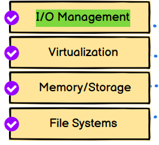
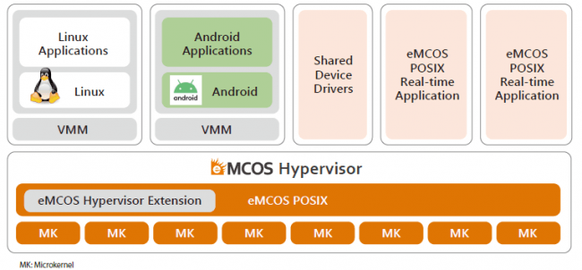

# Lesson 1. Intro to DevOps. Docker

### Что такое DevOps ?

DevOps - это набор практик и инструментов для автоматизации процессов разработки, тестирования и развертывания приложений. DevOps - это культура, которая объединяет разработчиков и операторов в единый процесс разработки и эксплуатации приложений.

### Что нужно знать DevOps инженеру ?

* I/O Managment in OS 
* * Input/Output management - это процесс передачи данных между внешними устройствами и памятью компьютера.
* Virtualization
* * Про виртуальные машины и их создание и управление
* Memory/Storage
* File Systems 

### Про сети и сетевые протоколы

`Ip` - Internet Protocol - это протокол, который определяет, как устройства могут обмениваться данными в сети. Каждое устройство в сети имеет уникальный IP-адрес, который используется для идентификации отправителя и получателя данных.
Работает на 3 уровне модели OSI, то есть на уровне сети.

`TCP` - Transmission Control Protocol - это протокол, который определяет, как устройства могут установить соединение между собой и передавать данные. TCP - это надежный протокол, который гарантирует, что данные будут доставлены в целостном виде. TCP - это протокол, работающий на 4 уровне модели OSI, то есть на уровне транспорта.

`UDP` - User Datagram Protocol - это протокол, который определяет, как устройства могут передавать данные без установления соединения. UDP - это ненадежный протокол, который не гарантирует, что данные будут доставлены в целостном виде. UDP - это протокол, работающий на 4 уровне модели OSI, то есть на уровне транспорта.

`HTTP` - Hyper Text Transfer Protocol - это протокол, который определяет, как устройства могут передавать данные в виде гипертекста. HTTP - это протокол, работающий на 7 уровне модели OSI, то есть на уровне приложений.

`HTTPS` - Hyper Text Transfer Protocol Secure - это протокол, который определяет, как устройства могут передавать данные в виде гипертекста по защищенному каналу. HTTPS - это протокол, работающий на 7 уровне модели OSI, то есть на уровне приложений.

`SSL certificate` - это цифровой сертификат, который используется для проверки подлинности веб-сайта и шифрования данных, передаваемых между браузером и сервером. SSL-сертификаты выдаются удостоверяющими центрами, которые проверяют подлинность веб-сайта и его владельца.

`SSH key` - это пара ключей, которая используется для проверки подлинности пользователя на удаленном сервере. SSH-ключи состоят из публичного и приватного ключей. Публичный ключ распространяется на удаленный сервер, а приватный ключ хранится на локальном компьютере. При подключении к удаленному серверу, сервер проверяет, что публичный ключ, который был отправлен на сервер, соответствует приватному ключу, который хранится на локальном компьютере. Если ключи совпадают, то пользователь получает доступ к удаленному серверу.

`MAC` - Media Access Control - это уникальный идентификатор, который присваивается сетевому адаптеру. MAC-адрес состоит из 6 байтов и записывается в шестнадцатеричном формате. MAC-адрес используется для идентификации устройства в локальной сети.

`DNS` - Domain Name System - это система, которая преобразует доменное имя в IP-адрес. DNS-серверы хранят информацию о доменных именах и их IP-адресах. Когда пользователь вводит доменное имя в браузере, браузер отправляет запрос на DNS-сервер, который возвращает IP-адрес доменного имени. После этого браузер отправляет запрос на IP-адрес, который был получен от DNS-сервера.

`DHCP` - Dynamic Host Configuration Protocol - это протокол, который позволяет устройствам автоматически получать IP-адрес, маску подсети, шлюз по умолчанию и другие настройки сети. DHCP-серверы хранят информацию о доступных IP-адресах и других настройках сети. Когда устройство подключается к сети, оно отправляет запрос на DHCP-сервер, который возвращает IP-адрес и другие настройки сети.

`POSIX` - Portable Operating System Interface - это набор стандартов, которые определяют, как должны работать операционные системы. POSIX-совместимые операционные системы могут работать с одними и теми же программами и утилитами.

К примеру:

## Про OS 

Что такое Linux ?
`Linux` - это операционная система, которая является бесплатной и открытой. Linux - это ядро операционной системы, которое управляет ресурсами компьютера и предоставляет приложениям доступ к ресурсам компьютера. Linux - это многозадачная многопользовательская операционная система, которая поддерживает множество архитектур процессоров.

Что такое Unix ?
`Unix` - семейство OS, таких как Linux, macOS, iOS, Android и т. д. Unix - это многозадачная многопользовательская операционная система, которая поддерживает множество архитектур процессоров.

Что такое Debian ? 
`Debian` - Это дистрибутив Linux, который является бесплатным и открытым. Debian - это многозадачная многопользовательская операционная система, которая поддерживает множество архитектур процессоров. 

Что такое дистрибутив ?
`Дистрибутив` - это операционная система, которая основана на ядре Linux. Дистрибутивы Linux могут быть бесплатными или платными. Дистрибутивы Linux могут быть открытыми или закрытыми. Дистрибутивы Linux могут быть многозадачными или однозадачными. Дистрибутивы Linux могут быть многопользовательскими или однопользовательскими. Дистрибутивы Linux могут поддерживать множество архитектур процессоров или только одну архитектуру процессора.

