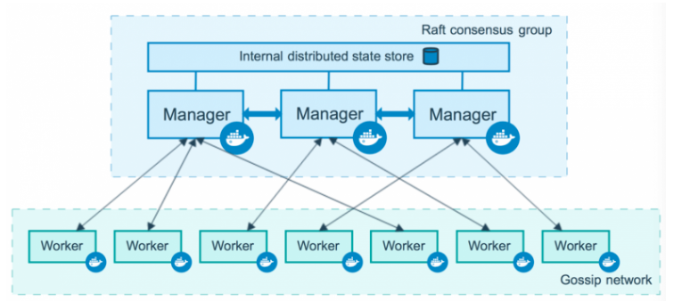

# Тема урока. Оркестрация 

## Что такое оркестрация ? Зачем нам его надо знать ? 

1. Оркестрация - это процесс управления контейнерами, которые у нас есть в кластере.

Но что такое кластер ? 
Кластер - это набор контейнеров, которые у нас есть.

## Один из примеров оркестрации - это `Kubernetes` и `Docker Swarm`

Если их сравнивать друг с другом, то я могу сказать из личного опыта swarm уже особо не используется, но он более простой в использовании, чем kubernetes и нам его надо знать в академических целях, так же как и мы выучили создание своих виртуальных сетей, хоть это и делает Docker Compose. 

## Давайте для начала поговорим про встроенную утилиту, которая есть в Docker. Называестся он Docker Swarm.

### Docker Swarm - это утилита, которая позволяет нам управлять кластером из Docker-хостов. Он делится на две части 
- менеджеры (manager)
- рабочие (worker)




### Менеджеры - это те, которые управляют кластером. Они принимают команды от пользователя и распределяют их по рабочим.

### Рабочие - это те, которые выполняют команды, которые пришли от менеджеров.

## Термины
Для того чтобы пользоваться swarm надо запомнить несколько типов сущностей:

`Node` - это наши виртуальные машины, на которых установлен docker. Есть manager и workers ноды. Manager нода управляет workers нодами. Она отвечает за создание/обновление/удаление сервисов на workers, а также за их масштабирование и поддержку в требуемом состоянии. Workers ноды используются только для выполнения поставленных задач и не могут управлять кластером.

`Stack` - это набор сервисов, которые логически связаны между собой. По сути это набор сервисов, которые мы описываем в обычном compose файле. Части stack (services) могут располагаться как на одной ноде, так и на разных.

`Service` - это как раз то, из чего состоит stack. Service является описанием того, какие контейнеры будут создаваться. Если вы пользовались docker-compose.yaml, то уже знакомы с этой сущностью. Кроме стандартных полей docker в режиме swarm поддерживает ряд дополнительных, большинство из которых находятся внутри секции deploy.

`Task` - это непосредственно созданный контейнер, который docker создал на основе той информации, которую мы указали при описании service. Swarm будет следить за состоянием контейнера и при необходимости его перезапускать или перемещать на другую ноду.


### Давайте посмотрим, как это работает на практике.

### Создание кластера
Для того чтобы кластер корректно работал, необходимо открыть следующие порты на виртуальных машинах. 
Для manager node:
- TCP port 2377 for cluster management communications
- TCP and UDP port 7946 for communication among nodes
- UDP port 4789 for overlay network traffic

```
firewall-cmd --add-port=2376/tcp --permanent;
firewall-cmd --add-port=2377/tcp --permanent;
firewall-cmd --add-port=7946/tcp --permanent;
firewall-cmd --add-port=7946/udp --permanent;
firewall-cmd --add-port=4789/udp --permanent;
firewall-cmd --reload;

systemctl restart docker;
```

Для worker node:
- TCP and UDP port 7946 for communication among nodes
- UDP port 4789 for overlay network traffic

```
firewall-cmd --add-port=2376/tcp --permanent;
firewall-cmd --add-port=7946/tcp --permanent;
firewall-cmd --add-port=7946/udp --permanent;
firewall-cmd --add-port=4789/udp --permanent;
firewall-cmd --reload;

systemctl restart docker;
```

Затем заходим на виртуальную машину, которая будет у нас manager node. И выполняем следующую команду:


```
docker swarm init 
```

Если все успешно, то в ответ вы получите следующую команду:

```
docker swarm join --token SWMTKN- ...
```


Ее будет необходимо выполнить на всех worker node, чтобы присоединить их в только что созданный кластер.

Если все прошло успешно, выполнив следующую команду на manager ноде в консоли, вы увидите что-то подобное:


```
docker node ls
ID                            HOSTNAME   STATUS    AVAILABILITY   MANAGER STATUS   ENGINE VERSION
vj7kp5847rh5mbbqn97ghyb72 *   dev-2      Ready     Active         Leader           20.10.14
zxo15m9wqdjd9f8pvg4gg6gwi     stage      Ready     Active                    
```

В принципе мы готовы к тому, чтобы запускать services и stacks на нашей worker node.

Если мы хотим убрать ноду из кластера, необходимо зайти на виртуалку, которая является ею, и выполнить команду:

```
docker swarm leave
```

Если затем зайти на manager ноду и выполнить docker node ls, вы заметите, что статус у нее поменялся c Ready на Down (это может занять некоторое время). Swarm больше не будет использовать данную ноду для размещения контейнеров, и вы можете спокойно заняться техническими работами, не боясь нанести вред работающим контейнерам. Для того чтобы окончательно удалить ноду, надо выполнить (на manager node):

```
docker node rm stage
```

Стэк и Сервис
Для создания нашего стэка я возьму в качестве примера compose файл для node js web server, который прослушивает порт 4003:

```yaml
services:
  back:
    image: docker-registry.ru:5000/ptm:stage
    ports:
      - "4003:4003"
    environment:
      TZ: "Europe/Moscow"
    extra_hosts:
      - host.docker.internal:host-gateway
    command: make server_start
    volumes:
      - /p/ptm/config/config.yaml:/p/ptm/config/config.yaml
      - /p/ptm/stat/web:/p/ptm/stat/web
```

В начале необходимо достать image из registry и только затем задеплоить в наш кластер:
```
docker pull docker-registry.ru:5000/ptm:stage;
docker stack deploy --with-registry-auth -c ./docker-compose.stage.yaml stage;
```

Для docker-compose.prod.yaml будет аналогично, но с тэгом prod (однако для внешнего мира надо использовать другой порт, например 4004). После деплоя данных stacks вы убедитесь, что сервисы разворачиваются только на нодах с определенным тэгом.


# Маршрутизация 
В данный момент у нас 3 ноды: manager нода, нода для stage версии приложения и еще одна для продакшена.

```
docker node ls
ID                            HOSTNAME   STATUS    AVAILABILITY   MANAGER STATUS   ENGINE VERSION
vj7kp5847rh5mbbqn97ghyb72 *   dev-2      Ready     Active         Leader           20.10.14
k3wjrl2o827in7k55wqfjfyxs     prod-1     Ready     Active                          20.10.14
zxo15m9wqdjd9f8pvg4gg6gwi     stage      Ready     Active  
```

И если мы попытаемся задеплоить наш стэк для docker-compose.prod.yaml на том же 4003 порту, что и для уже запущенного стэка docker-compose.stage.yaml, мы получим ошибку, связанную с тем, что порт уже занят.

Хммм... почему это произошло?🤔 И более того, если мы зайдем на виртуальную машину prod-1 и сделаем curl 127.0.0.1:4003, то увидим, что наш сервис доступен, хотя на этой ноде мы еще не успели ничего развернуть ?


Связано это с тем, что у swarm имеется ingress сеть, которая используется для маршрутизации траффика между нодами. Если у сервиса есть публичный порт, то swarm слушает его и в случае поступления запроса на него делает следующее: определяет есть ли контейнер на этой хост машине и если нет, то находит ноду, на которой запущен контейнер для данного сервиса, и перенаправляет запрос туда.


В данном примере используется внешний балансировщик HAProxy, который балансирует запросы между тремя виртуалками, а дальше swarm перенаправляет запросы в соответствующие контейнеры.

Вот почему придется для docker-compose.prod.yaml использовать любой другой публичный порт, отличный от того, который мы указали в docker-compose.stage.yaml.

Отключить автоматическую маршрутизацию трафика можно с помощью mode: host при декларации ports:
```

# docker-compose.prod.yaml
version: "3.9"

services:
  back:
    image: docker-registry.ru:5000/ptm:stage
    ports:
		  - target: 4003
    		published: 4004
		    protocol: tcp
    		mode: host
    environment:
      TZ: "Europe/Moscow"
    extra_hosts:
      - host.docker.internal:host-gateway
    command: make server_start
    volumes:
      - /p/ptm/config/config.yaml:/p/ptm/config/config.yaml
      - /p/ptm/stat/web:/p/ptm/stat/web
    # swarm
    deploy:
      placement:
        constraints:
          - "node.labels.TAG==prod"

```

В данном случае запрос, который придет на порт 4004, swarm будет направлять только на контейнер текущей ноде и никуда больше.

Кроме того, надо упомянуть про такую настройку как mode, хотя напрямую это не относится к маршрутизации. Она может принимать следующие значения: global или replicated (по умолчанию):

```
deploy:
	mode: global

deploy:
	mode: replicated
  replicas: 4
```