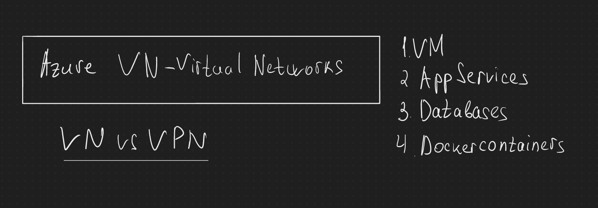

# Azure Virtual Networks

### Зачем нам нужны виртуальные сети ?
- Виртуальные сети позволяют объединять виртуальные машины, контейнеры и сервисы в общую сеть

### Не надо путать VPN и VNet
- VPN - это технология, которая позволяет объединять несколько сетей в одну
- VNet - это виртуальная сеть, которая объединяет виртуальные машины, контейнеры и сервисы в общую сеть

### Vnet может быть.
- Внутри операционной системы
- Внутри сервера 

### Azure Load Balancer

Load Balancer - это сервис, который позволяет распределять нагрузку между виртуальными машинами внутри одной сети.

Как он работает:
- Виртуальная машина отправляет запрос на Load Balancer
- Load Balancer отправляет запрос на одну из виртуальных машин
- Виртуальная машина отправляет ответ на Load Balancer
- Load Balancer отправляет ответ на виртуальную машину

### Azure VPN Gateway
VPN - это технология, которая позволяет объединять несколько сетей в одну
VPN Gateway - это сервис, который позволяет объединять виртуальные сети в одну

### Azure Application Gateway
Application Gateway - это сервис, который позволяет распределять нагрузку между веб-серверами внутри одной сети.

### Azure ExpressRoute
ExpressRoute - это сервис, который позволяет подключить вашу сеть к Azure посредством прямого физического соединения.

### CDN (Content Delivery Network)
CDN - это сервис, который позволяет ускорить доставку статических файлов (например, картинок) до пользователей.

Давайте возьмем пример:
- У нас есть сайт, который хранится в Azure
- На сайте есть картинка, которая хранится в Azure
- Пользователь заходит на сайт
- Браузер пользователя скачивает картинку с Azure
- Браузер пользователя отображает картинку
- Пользователь видит картинку
- Пользователь счастлив
- Картинка хранится в Azure в США
- Пользователь находится в России
- Браузер пользователя скачивает картинку с Azure в США
- Браузер пользователя отображает картинку
- Пользователь видит картинку
- Пользователь не счастлив, потому что картинка загрузилась долго
- Пользователь уходит на другой сайт
- Владелец сайта теряет деньги
- Владелец сайта не счастлив
 
По итогу мы создаем подсервера(CDN), на которые грузятся данные, а они в свою очередь уже отдают данные пользователю. Таким образом мы ускоряем загрузку данных.

